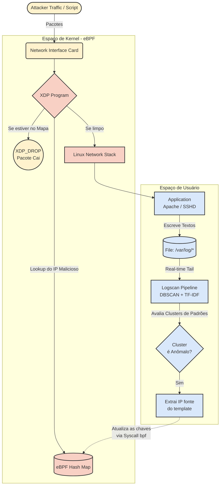

    
    <h1>🛡️ Logscan-XDP</h1>
    <i>High-Performance Security Logscanner powered by DBSCAN and C-eBPF.</i>
     
    <b>Version: 1.0</b>

 

## 📌 Abstract

## 🎯 Key Features

---

## 🏛️ Architecture Blueprint

---

## 🛠️ Build & Usage

---

## ⚖️ License

Distributed under the **GNU General Public License v2.0**.
Designed for high-performance network analysis and community-driven security research.

