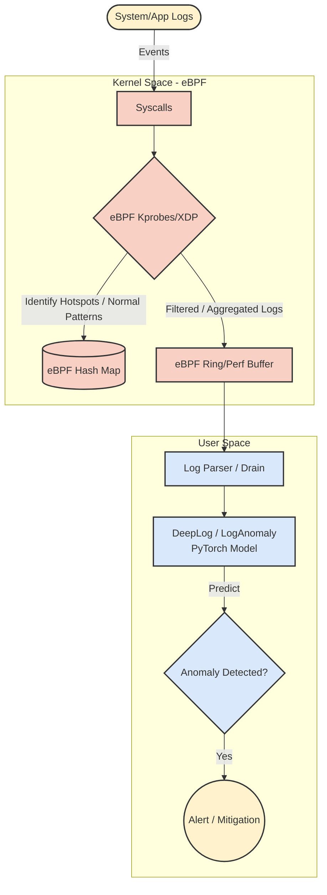

<div align="center">
    
    <h1>🛡️ Logscan-XDP</h1>
    <i>Accelerating Deep Learning Log Anomaly Detection (DeepLog) using eBPF/XDP In-Kernel Pre-processing</i>
    <br>
    <b>Version: 1.0</b>
</div>

<br>

## 📌 Abstract


## 🎯 Key Features


---

## 🏛️ Architecture Blueprint



---

## 📁 Project Structure

- `assets/`: Static assets such as logos and images.
- `devrefs/`: Reference documentation, timeline check-lists, experiment diaries, and iteration history.
- `results/`: Output results, scientific analysis, and figures.
  - `data/`: CSV raw baseline data (`baseline.csv`).
  - `images/`: High-resolution scientific figures (accuracy, execution time, and system resource picos).
  - `notebooks/`: Jupyter Notebook (`baseline_analysis.ipynb`) for interactive plotting and analytical discussions.
  - `scripts/`: Python scripts (`generate_baseline_plots.py`) to compile high-quality publication-grade figures.
- `src/`: Source code directory for the project.
  - `ebpf/`: eBPF/XDP C programs for log filtering and high-performance pre-processing in the kernel.
  - `logdeep/`: Submodule containing PyTorch implementations of deep learning-based log anomaly detection models (DeepLog).
  - `parser/`: Parsing scripts (`drain_parser.py` using Drain/Drain3) and baseline profiling orchestrators (`collect_baseline.py`).

---

## 🛠️ Build & Usage

### 1. Prerequisites & Environment Setup
Our environment relies on **Python 3.10** and **PyTorch** with **GPU CUDA** support:
```bash
# Setup virtual environment
python3 -m venv .venv
source .venv/bin/activate

# Install required dependencies
pip install -r requirements.txt
```

### 2. Dataset Pre-processing (Drain Parser)
To parse raw HDFS semi-structured log lines into Event IDs and structured PyTorch matrices, execute the high-performance incremental parser:
```bash
python src/parser/drain_parser.py
```
This will generate `hdfs_train`, `hdfs_test_normal`, `hdfs_test_abnormal`, and supervision splits (`train.csv`, `valid.csv`, `test.csv`) under `src/logdeep/data/hdfs/`.

### 3. Running baseline Training & Evaluation
To run the automated baseline collection pipeline (trains DeepLog for 15 epochs on CUDA GPU, performs inference, tracks CPU/RAM peak resources in real-time, and saves the consolidated metrics):
```bash
python src/parser/collect_baseline.py
```
The metrics will be stored inside `results/data/baseline.csv`.

---

## 🧪 Scientific Plotting & Analysis

### 1. Generating Figures for Paper / Thesis
Compile publication-grade scientific plots (300 DPI) dynamically from the baseline data:
```bash
python results/scripts/generate_baseline_plots.py
```
This produces three professional charts in `results/images/`:
- `baseline_metrics.png` (Precision, Recall, F1-Score)
- `baseline_time_comparison.png` (Training GPU vs. User Space Inference Time)
- `baseline_resource_usage.png` (Host CPU & Memory peak consumption)

### 2. Interactive Analysis
Launch JupyterLab and open the baseline analysis notebook under `results/notebooks/baseline_analysis.ipynb` to view interactive plots and discussions:
```bash
jupyter lab results/notebooks/baseline_analysis.ipynb
```

---

## ⚖️ License

Distributed under the **GNU General Public License v2.0**.
Designed for high-performance network analysis and community-driven security research.

