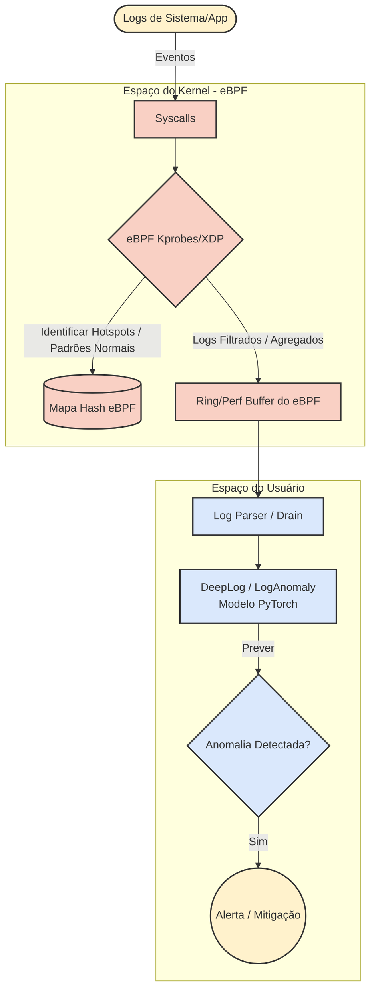

<div align="center">
    
    <h1>🛡️ Logscan-XDP</h1>
    <i>Acelerando a Detecção de Anomalias em Logs por Aprendizado Profundo (DeepLog) usando Pré-processamento no Kernel com eBPF/XDP</i>
    <br>
    <b>Versão: 1.0</b>
</div>

<br>

## 📌 Resumo


## 🎯 Principais Recursos


---

## 🏛️ Desenho da Arquitetura



---

## 📁 Estrutura do Projeto

- `assets/`: Recursos estáticos, como logotipos e imagens.
- `devrefs/`: Documentação de referência, listas de verificação de cronogramas, diários de experimentos e histórico de iterações.
- `results/`: Resultados de saída, análises científicas e figuras.
  - `data/`: Dados brutos de baseline em formato CSV (`baseline.csv`).
  - `images/`: Figuras científicas de alta resolução (acurácia, tempo de execução e picos de recursos do sistema).
  - `notebooks/`: Jupyter Notebook (`baseline_analysis.ipynb`) para plotagem interativa e discussões analíticas.
  - `scripts/`: Scripts em Python (`generate_baseline_plots.py`) para compilar figuras de qualidade para publicação.
- `src/`: Diretório de código-fonte do projeto.
  - `ebpf/`: Programas em C para eBPF/XDP para filtragem de logs e pré-processamento de alta performance no kernel.
  - `logdeep/`: Submódulo contendo implementações em PyTorch de modelos de detecção de anomalias em logs baseados em aprendizado profundo (DeepLog).
  - `parser/`: Scripts de análise sintática (`drain_parser.py` usando Drain/Drain3) e orquestradores de perfil de baseline (`collect_baseline.py`).

---

## 🛠️ Compilação e Configuração (Build)

### 1. Pré-requisitos do Sistema
Para compilar o código eBPF e executar o projeto, instale os compiladores, bibliotecas de desenvolvimento do eBPF e utilitários necessários no Ubuntu:
```bash
# Atualizar repositórios do sistema
sudo apt update

# Instalar dependências essenciais de build, LLVM/Clang e bibliotecas do BPF
sudo apt install -y build-essential git python3-pip python3-venv \
                   clang llvm libelf-dev libpcap-dev pkg-config \
                   libbpf-dev gcc-multilib

# Instalar o bpftool correspondente à versão do seu kernel Linux
sudo apt install -y linux-tools-common linux-tools-generic linux-tools-$(uname -r)
```

### 2. Configurações de Buffer de Rede UDP (Otimização do Kernel)
Por padrão, o Linux limita os buffers do socket UDP a valores baixos. Para garantir que as perdas de pacotes nos experimentos sejam causadas puramente pelo tempo de processamento da IA (DeepLog) e não por limites de rede, aumente o tamanho máximo dos buffers UDP executando:
```bash
# Configurar em tempo de execução
sudo sysctl -w net.core.rmem_max=16777216
sudo sysctl -w net.core.wmem_max=16777216
sudo sysctl -w net.core.rmem_default=4194304
sudo sysctl -w net.core.wmem_default=4194304
```
> [!TIP]
> Para tornar essas configurações persistentes entre reinicializações, adicione as linhas acima ao arquivo `/etc/sysctl.conf`.

### 3. Configuração do Ambiente Virtual Python
Configure o ambiente Python e instale as dependências listadas em [requirements.txt](file:///home/saar/code/mestrado/logscan-xdp/requirements.txt):
```bash
# Inicializar o ambiente virtual do Python 3
python3 -m venv .venv-logscan
source .venv-logscan/bin/activate

# Atualizar pip e instalar dependências do projeto
pip install --upgrade pip
pip install -r requirements.txt
pip install psutil
```

### 4. Compilação do Código eBPF (Kernel Space)
O filtro eBPF CO-RE precisa ser compilado para um formato binário ELF objeto antes do uso. Você pode fazer isso usando o [Makefile](file:///home/saar/code/mestrado/logscan-xdp/Makefile) fornecido:
```bash
# Compilar os arquivos src/ebpf/main.bpf.c e src/ebpf/log_filter.bpf.c
make

# Para limpar os artefatos de compilação anteriores
make clean
```
Após o `make`, os arquivos compilados `main.bpf.o` e `log_filter.bpf.o` serão gerados no diretório `src/ebpf/`.

---

## 🚀 Guia de Uso

### 1. Preparação dos Dados de Teste
Antes de rodar o orquestrador inteligente ou a suite de testes, utilize o script preparador de amostra de logs de teste para processar o dataset HDFS e gerar os gabaritos JSON e hashes estáticos correspondentes:
```bash
# Executar a amostragem automática de teste
python3 tests/integration/prepare_test_data.py
```
Esse comando irá ler o log bruto do HDFS, gerando o log de testes `HDFS_test.log`, a tabela de gabaritos reais de anomalias `HDFS_test_labels.json` e o dicionário de hashes `hash_to_event.json` dentro do diretório `full_dataset/HDFS/`.

### 2. Pré-processamento Base do Dataset (Drain Parser)
Para parsear e processar os logs brutos estruturando-os em matrizes PyTorch de treino e teste do DeepLog:
```bash
python3 src/parser/drain_parser.py
```

### 3. Execução do Daemon Orquestrador (User Space)
O Daemon em [main.py](file:///home/saar/code/mestrado/logscan-xdp/src/main.py) carrega o filtro eBPF no Kernel via `bpftool autoattach`, registra seu PID e executa em paralelo a escuta da porta UDP `9999` e a inferência online no DeepLog.

```bash
# Rodar utilizando o eBPF no Kernel (Requer privilégios ROOT para eBPF)
sudo .venv-logscan/bin/python3 src/main.py

# Rodar em modo Baseline tradicional (Desativa o eBPF e processa apenas em User Space)
python3 src/main.py --no-ebpf

# Parâmetros disponíveis:
#   --no-ebpf          Pula a injeção e execução do filtro eBPF no Kernel
#   --parser [miope|drain3]  Algoritmo de parsing (Padrão: 'miope')
#   --output [caminho] Caminho do arquivo CSV de saída consolidado
```

### 4. Coleta de Métricas do Baseline Puro
Para treinar a IA DeepLog (15 épocas) e avaliar o desempenho padrão sem eBPF em tempo real salvando o log em `results/data/baseline.csv`:
```bash
python3 src/parser/collect_baseline.py
```

---

## 🧪 Suíte de Testes e Validação

O projeto disponibiliza três suites de testes destinadas a certificar a corretude e a performance da filtragem eBPF e da detecção por inteligência artificial:

### 1. Testes Unitários do Filtro eBPF (sys_write local)
Valida a lógica do rate limit e descarte de logs redundantes no Kernel (hotspots) simulando uma tempestade local de 200 escritas repetitivas no disco através do hook eBPF.
> [!IMPORTANT]
> Deve ser executado obrigatoriamente como ROOT (`sudo`), preferencialmente apontando para o interpretador virtualenv.

```bash
sudo .venv-logscan/bin/python3 tests/unit/test_ebpf_filter.py
```

### 2. Testes de Integração Automatizados (Containerlab + Podman)
Levanta uma topologia de rede virtual com contêineres simulando o emissor de tráfego (`traffic_generator`) e o receptor da IA (`victim_server`), ideal para testar localmente em um ambiente isolado.
```bash
# Execução direta via Makefile (chama o script run_integration_test.sh)
make integration-test

# Execução customizada via script de teste
./tests/integration/run_integration_test.sh [--no-ebpf] [--rate <taxa>] [--parser <miope|drain3>] [--output <csv>]
```

### 3. Experimentos em Máquinas Virtuais (LabVM)
Para experimentos reais e de medição de latência/perdas UDP entre duas máquinas virtuais distintas (Vítima em `192.168.122.100` e Atacante em `192.168.122.101`):
*   **Na VM Vítima (Receptor/IA):**
    ```bash
    cd tests/labvm
    source ../../.venv-logscan/bin/activate
    ./run_experiments.sh
    ```
*   **Na VM Atacante (Emissor):**
    ```bash
    python3 sender_vm.py --ip 192.168.122.100 --rate <taxa>
    ```

*   **Validação de Descarte puro no Kernel (Override Return local):**
    Caso queira testar a ação do `bpf_override_return` interceptando e descartando logs locais diretamente no Kernel sem o uso de sockets de rede UDP:
    ```bash
    cd tests/labvm
    sudo ./run_experiments_override_return.sh
    ```

---

## 📊 Geração de Gráficos Científicos e Análise

### 1. Plotando as Imagens Científicas para Artigos / Dissertações
Gere gráficos de publicação (alta resolução, 300 DPI) compilados dinamicamente a partir dos resultados dos experimentos de baseline:
```bash
python3 results/scripts/generate_baseline_plots.py
```
Isso produzirá na pasta `results/images/`:
*   `baseline_metrics.png` (Precisão, Sensibilidade e F1-Score)
*   `baseline_time_comparison.png` (Tempos de Treinamento vs. Inferência)
*   `baseline_resource_usage.png` (Consumo de CPU e Memória)

### 2. Análise Interativa (Jupyter Notebook)
Para visualizar gráficos interativos e discussões científicas adicionais, execute o JupyterLab:
```bash
jupyter lab results/notebooks/baseline_analysis.ipynb
```

---

## ⚖️ Licença

Distribuído sob a licença **GNU General Public License v2.0**.
Projetado para análise de rede de alta performance e pesquisa de segurança voltada à comunidade.

